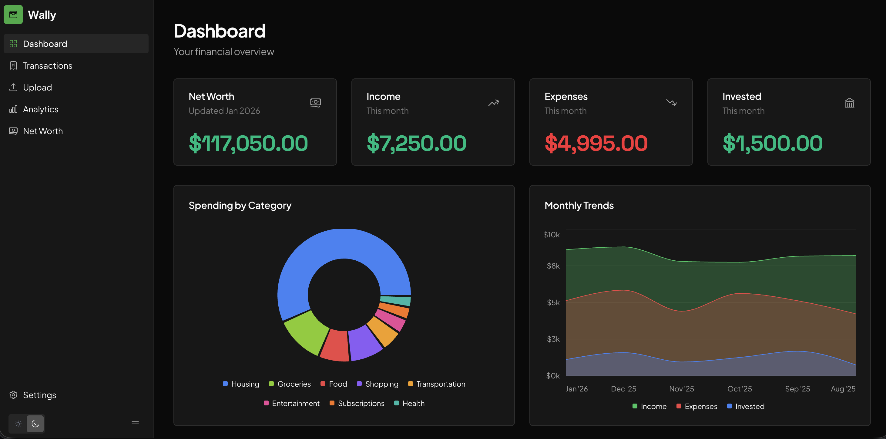
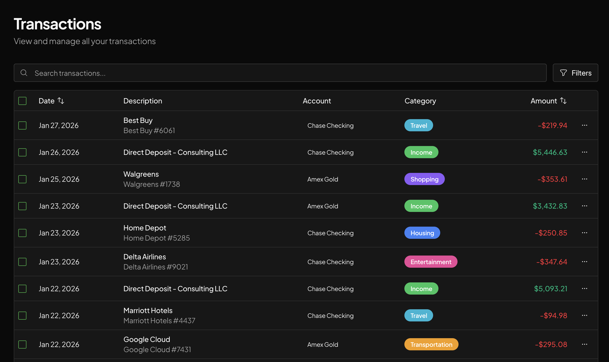
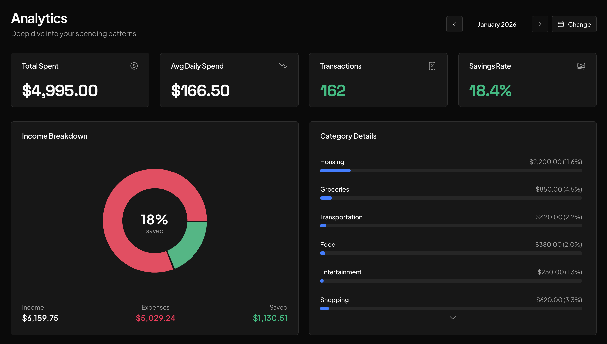
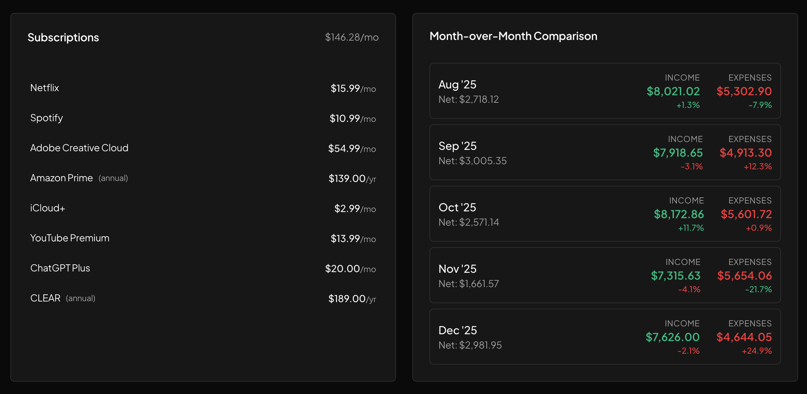
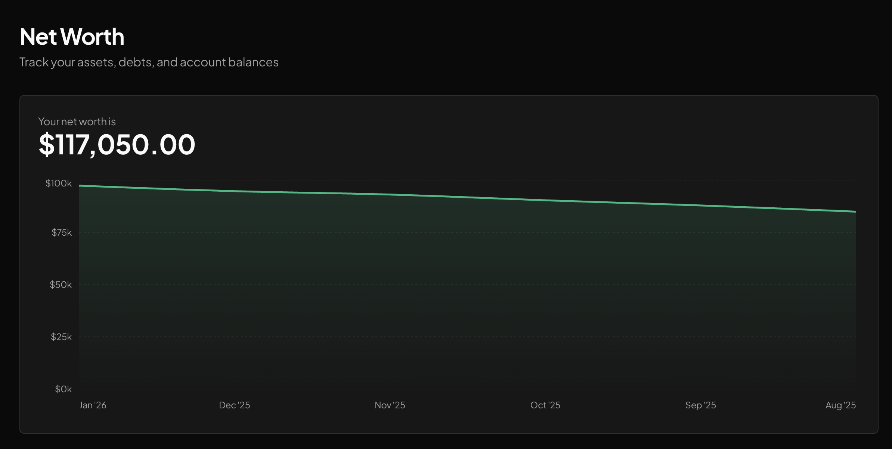
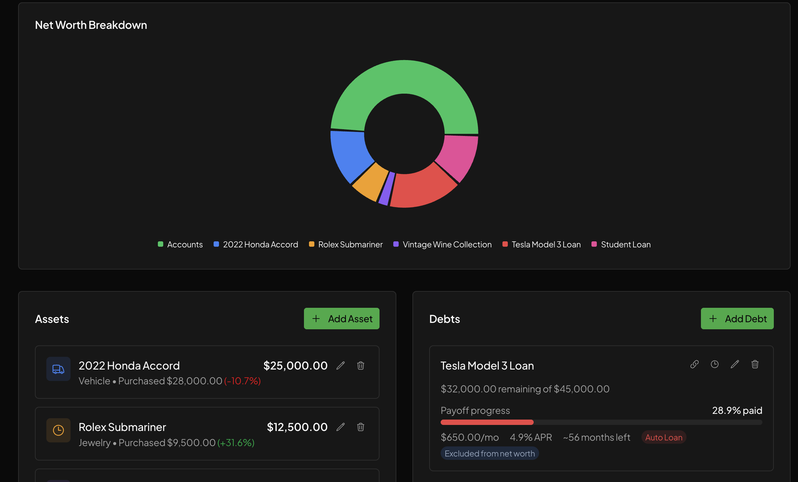

# Wally

[](https://opensource.org/licenses/MIT)

**Your finances, your computer, your control.**

Wally is a personal finance app that runs entirely on your machine. Upload bank statements, track spending, and monitor your net worth—all without sending your financial data to the cloud.

## Why Wally?

### 100% Local & Private
Your financial data never leaves your computer. Unlike cloud-based finance apps like Mint or Copilot, Wally stores everything in a local SQLite database on your machine. No accounts to create. No servers storing your transaction history.

### AI-Powered, Privacy-Conscious
Wally uses AI to extract transactions from PDFs and categorize spending—but only when you explicitly upload a statement. Your data sits locally; AI is just a tool that processes documents on demand.

### Smart Categorization That Adapts to You
Categories are fully customizable—create your own or modify the defaults to match how you think about your spending. When you correct a category, Wally learns from it: your corrections are fed back to the AI, so it gets smarter over time and makes fewer mistakes on similar transactions.

### Built for Power Users
Wally is open source and runs as a local web app. Customize it, extend it, or use it with Claude Code to build your own financial workflows.

## Screenshots



<details>
<summary>More screenshots</summary>

### Transactions


### Analytics



### Net Worth



</details>

## What You Can Do

- **Import statements** from any bank or credit card (PDF upload with AI extraction)
- **Track all transactions** across checking, savings, credit cards, and investments
- **See where your money goes** with spending breakdowns by category and merchant
- **Monitor spending trends** month-over-month with interactive charts
- **Track your net worth** over time, including assets and liabilities

## Getting Started

### Prerequisites

- Node.js 18+
- An [OpenRouter API key](https://openrouter.ai/keys) for AI-powered PDF parsing (Open Router doesn't store inputs/outputs)

### Installation

```bash
git clone https://github.com/alec2020/wally.git
cd wally
npm install
npm run dev
```

Open [http://localhost:3000](http://localhost:3000) and you're ready to go.

### Setup

1. Go to **Settings** and add your OpenRouter API key
2. Upload your first bank statement from the **Upload** page
3. Review extracted transactions and start tracking

## Using Wally with Claude Code

Wally is designed to work seamlessly with [Claude Code](https://docs.anthropic.com/en/docs/claude-code), Anthropic's AI coding assistant. Because all your data is stored locally in a SQLite database, Claude Code can help you:

- **Query your finances directly**: Ask questions like "What did I spend on restaurants last month?" or "Show me my largest expenses this year" and Claude Code can write and run SQL queries against your local database.

- **Build custom reports**: Need a specific analysis your finance app doesn't offer? Describe what you want and Claude Code can create it—export to CSV, generate charts, or build new dashboard views.

- **Automate workflows**: Set up custom categorization rules, bulk-edit transactions, or create scripts to process statements from specific institutions.

- **Extend the app**: Add new features, integrate with other local tools, or customize the UI to match your workflow.

To get started, open Claude Code in the Wally directory:

```bash
cd wally
claude
```

Then ask Claude Code to help with your finances. Your data stays local—Claude Code reads your database file directly on your machine.

## Privacy & Data

**What stays local:**
- All transactions, accounts, and net worth data (stored in `finance.db`)
- Uploaded PDF statements
- Your settings and preferences

**What's sent externally (only when you upload a statement):**
- PDF content → OpenRouter API for transaction extraction
- Transaction descriptions → OpenRouter for AI categorization (optional)

OpenRouter does not store or log your inputs and outputs—data is processed and discarded.

No accounts. No tracking. No analytics. Just your data on your computer.

## Tech Stack

- Next.js 14 (App Router)
- SQLite via better-sqlite3
- Radix UI + Tailwind CSS
- Recharts for visualizations
- OpenRouter for AI features

## License

MIT—use it however you want.
